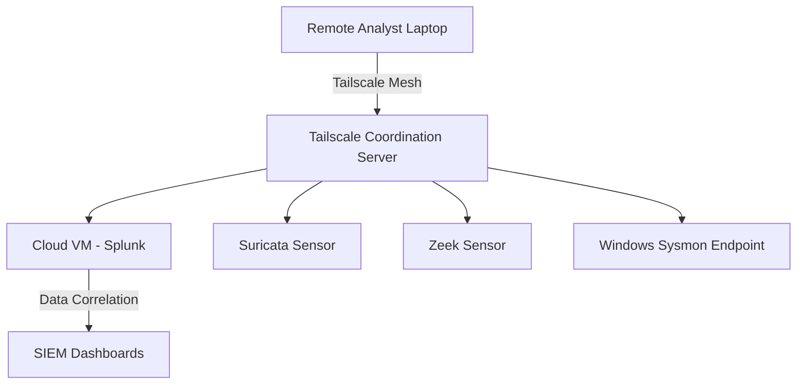

# Tailscale Integration in Enterprise Network Monitoring & Detection Project

## Overview
Tailscale was used in this project to enable secure, encrypted, and seamless remote connectivity between distributed nodes and the central monitoring infrastructure (Splunk, Suricata, Zeek, and Sysmon endpoints). It allowed team members and monitoring agents to join a zero-trust mesh network without exposing services to the public internet.

---

## Configuration Steps

1. **Installation**
   - Installed Tailscale on all endpoints (Windows, Linux, Cloud VMs).
   - Command used on Linux:
     ```bash
     curl -fsSL https://tailscale.com/install.sh | sh
     sudo tailscale up --authkey <AUTH_KEY>
     ```

2. **Authentication & Access Control**
   - Used organization-based authentication with SSO integration.
   - Configured ACL policies in the Tailscale admin console to restrict access based on user roles (Blue Team, Red Team, GRC Analysts).

3. **Subnet Routing & Exit Nodes**
   - Enabled subnet routing for cloud and on-premise segments:
     ```bash
     sudo tailscale up --advertise-routes=10.0.0.0/24
     ```
   - Configured exit nodes for secure internet access from remote locations.

4. **Integration with Monitoring Tools**
   - All traffic between endpoints (Suricata, Zeek sensors, Sysmon Windows agents) and Splunk forwarders was tunneled through the Tailscale mesh.
   - Ensured encrypted transport (WireGuard-based).

---

## Diagram: Tailscale Integration Architecture



---

## Limitations & Issues Encountered

1. **Rate Limiting & Bandwidth Throttling**
   - High traffic from Suricata and Zeek sensors caused initial performance bottlenecks.
   - **Solution:** Adjusted sampling rates and optimized sensor configurations.

2. **ACL Policy Conflicts**
   - Initial ACL policies blocked some team members unintentionally.
   - **Solution:** Implemented granular team-based rules and tested access.

3. **NAT Traversal Failures**
   - Some endpoints behind strict firewalls failed to connect.
   - **Solution:** Enabled Tailscale DERP relay servers for fallback connections.

4. **DNS Resolution Issues**
   - Internal DNS records were not resolving across all nodes.
   - **Solution:** Integrated MagicDNS and synchronized with internal DNS servers.

---

## Outcomes
- **Improved Security Posture:** Encrypted zero-trust network.
- **Seamless Remote Access:** Analysts and sensors connected without exposing public IPs.
- **Faster Incident Response:** Centralized monitoring from distributed locations.

---

## Next Steps
- Automate Tailscale provisioning with Terraform/Ansible.
- Integrate multi-factor authentication for critical roles.
- Conduct periodic audits of ACL policies.


